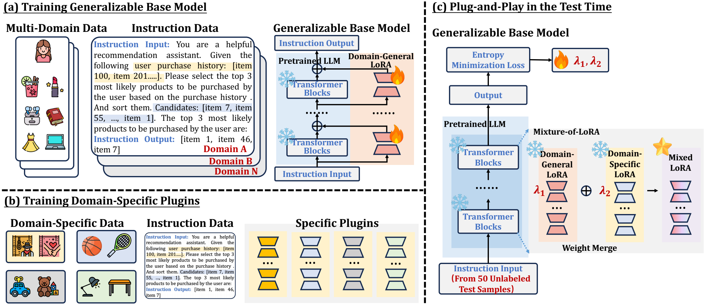

# MoLoRec: A Generalizable and Efficient Framework for LLM-Based Recommendation
## 1. Introduction
   
We propose a generalizable and efficient LLM-based recommendation framework MoLoRec. Our approach starts by parameter-efficient fine-tuning a domain-general module with general recommendation instruction data, to align LLM with recommendation knowledge. Then, given users’ behavior of a specific domain, we construct a domain-specific instruction dataset and apply efficient fine-tuning to the pre-trained LLM. After that, we provide approaches to integrate the above domain-general part and domain-specific part with parameters mixture. Please note that, MoLoRec is efficient with plug and play, as the domain-general module is trained only once, and any domain-specific plug-in can be efficiently merged with only domain-specific fine-tuning.   

In the following, we will guide you how to use this repository step by step. 🤗
## 2. Preparation
### 2.1 Requirements
You can use the following commands to configure the environment required for codes.   
```bash
conda create -n molorec python=3.11.9  
conda activate molorec
sh scripts\env.sh
```
### 2.2 Data Preparation
You can use the following commands to download and process the dataset.    
```bash
sh scripts\download_data.sh
sh scripts\make_data.sh
```
Of course, you can also directly download the processed data from the [[Google Drive](https://drive.google.com/file/d/1T1MQiVnTOSnx19jKIH9IfFWrYotEk1ZB/view?usp=sharing)]. Note that the cold start test dataset does not have processing code and needs to be downloaded.
## 3. Training
### 3.1 module training
First, download [Qwen2-7B-Instruct](https://huggingface.co/Qwen/Qwen2-7B-Instruct) into folder `models`, then use the following commands to get general module and specific module.
```bash
sh scripts\train_lora.sh
```
You can also download the module we provide from the [[Google Drive](https://drive.google.com/file/d/1Yumwy7EyJZkeGmFzePpbtssMbOk8LiT4/view?usp=sharing)]
### 3.2 Weights learning
First, copy files in `models\Qwen2-7B-Instruct-edit` to `models\Qwen2-7B-Instruct`, then use the following commands to learn the weights of module fusion.
```bash
sh scripts\beauty_weights.sh
sh scripts\toys_weights.sh
sh scripts\sports_weights.sh
```
## 4. Test and Metrics
You can use the following commands to test model
```bash
sh scripts\test_weights.sh
```
And use the following commands to find best fusion weights and output the metrics
```bash
sh scripts\metrics.sh
```
## 5. Acknowledgements  
Our code is based on the implementation of [peft](https://github.com/huggingface/peft) and [transformers](https://github.com/huggingface/transformers).

## 6. 更改  
由于作者上传的存储库已过期，上传了之前下载的项目到 GitHub 上，用于课程项目的检查，方便学习应用，并且上传了一个新的数据库，用于验证。虽然 MOOC 数据集的结果可能不尽如人意，如有侵权，联系删除。
